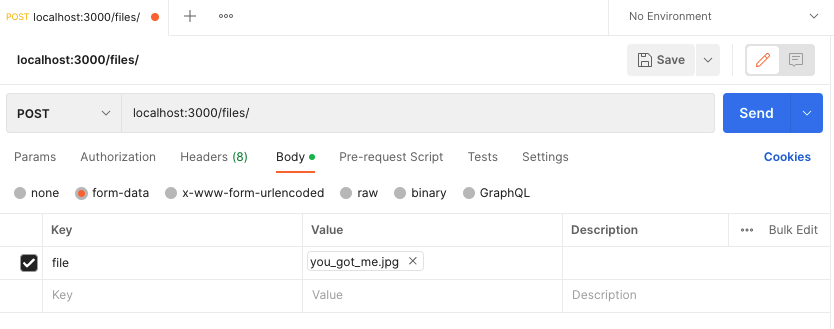

# File Sharing API - meldCX Code Challenge

## Table of Content
* [Description](#description)
* [How to run the server](#how-to-run-the-server)
  * [Sneak Peak](#just-want-to-have-a-peek)
  * [Step-by-Step Instruction](#step-by-step-instruction)
  * [TL;DR](#tldr)
* [API Documentation](#api-documentation)
  * [POST /files - Upload a file](#1-post-files---upload-a-file)
  * [GET /files/:publicKey - Download a file](#2-get-filespublickey---download-a-file)
  * [DELETE /files/:privateKey - Delete a file](#3-delete-filesprivatekey---delete-a-file)
* [Discussion](#discussion)
* [Directory Structure](#directory-structure)

---

## Description

This is a README file serving as a mini documentation of the challenge project 
that I worked on in the allowed time frame.
* 👨🏻‍💻 Author: Rui Hu (@[logreg-n-coffee](https://github.com/logreg-n-coffee))
* 🌱 Date of Reception: **April 15, 2023 7:58 MST** (Phoenix, AZ, USA)
* 🌳 Date of Delivery: _by_ **April 17: 2023 7:58 MST** (Phoenix, AZ, USA)

Please let me know if you have any questions or suggestions. Thank you. 🥳

---

## How to run the server

### Just want to have a peek

Install the packages and start:

```bash
npm install && npm start
```

In your browser, get the sample file:
* http://localhost:3000/files/a6a13488-b469-4488-ad94-9c2391bece68
* http://127.0.0.1:3000/files/a6a13488-b469-4488-ad94-9c2391bece68


### Step-by-Step Instruction

1. Download or clone the repository.
2. Locate to the root directory of the project.
3. Install the required dependencies by running `npm install`.
4. Configure environment variables by modifying the `.env` file in the root folder. (_optional_)
5. Start the API server using the `npm start` command
6. Run unit and integration tests using the `npm test` command

### TL;DR

To run for the first time:
```bash
npm install
```

To start:
```bash
npm start
```

To run Existing Test:
```bash
npm test
```

---

## API Documentation

The following are the sample requests and responses. Please use the API testing tools as you wish.
I usually use Postman to test my APIs. The following is a screenshot of my Postman settings.



### 1. POST /files - Upload a file

Upload a file to the server. The API will return a JSON object containing public and private keys for future reference.

#### Sample Request

```bash
POST /files
Content-Type: multipart/form-data
Content-Disposition: form-data; name="file"; filename="example.txt"
Content-Type: text/plain

< ./path/to/example.txt
```

#### Sample Response

```bash
HTTP/1.1 201 Created
Content-Type: application/json

{
    "publicKey": "a6a13488-b469-4488-ad94-9c2391bece68",
    "privateKey": "6603273e-413b-4e04-a106-2085ff7de04c"
}
```

### 2. GET /files/:publicKey - Download a file

Download a file from the server. The API will return the content of the file.

#### Sample Request

```bash
GET /files/a6a13488-b469-4488-ad94-9c2391bece68
```

#### Sample Response

```bash
HTTP/1.1 200 OK
Content-Type: text/plain

This is the content of the uploaded file.
```

### 3. DELETE /files/:privateKey - Delete a file

Delete a file from the server using its private key.

#### Sample Request

```bash
DELETE /files/6603273e-413b-4e04-a106-2085ff7de04c
```

#### Sample Response

```bash
HTTP/1.1 200 OK
Content-Type: application/json

{
  "message": "The file has been successfully deleted"
}
```

---

## Discussion

I attempted the project within the limited timeframe. 
Due to limited time, I have documented possible improvements to my project. 

1. **Error handling and logging:** 
   - Enhance error handling throughout the application to provide better debugging information and handle edge cases. 
   - Consider using a logging library to log important events and errors.
2. **Security:** 
   - Implement security best practices for API
     - add an authentication layer to protect the endpoints, 
     - use helmet middleware for setting various HTTP headers, and 
     - sanitize user inputs to prevent potential attacks.
3. **Caching:** 
   - Implement caching for frequently accessed files to improve performance
     - Use libraries like redis for in-memory caching or 
     - memory-cache for a simpler caching mechanism.
4. **Performance optimization:** 
   - Analyze and optimize the performance of the application. 
     - Use profiling tools like `node --inspect` or 
     - libraries like `clinic` to identify performance bottlenecks and optimize the code.
5. **Scalability:** 
   - Consider deploying the application to a cloud provider like AWS, Google Cloud, or Microsoft Azure. 
     - Make it easier to scale the application as needed, providing better availability and reliability.
6. **Continuous Integration/Continuous Deployment (CI/CD):** 
   - Set up a CI/CD pipeline for the project using services like 
     - GitHub Actions, 
     - GitLab CI/CD, or 
     - Jenkins. 
   - This will help automate testing, building, and deploying the application.
     - Ensure that the code remains stable and up-to-date.

---

## Directory Structure

```
meldcx-code-challenge/
|-- src/
|   |-- config/
|   |   |-- index.js
|   |-- storage/
|   |   |-- index.js
|   |   |-- local-storage.js
|   |   |-- google-cloud-storage.js
|   |-- api/
|   |   |-- index.js
|   |-- utils/
|   |   |-- index.js
|   |-- app.js
|-- test/
|   |-- integration/
|   |   |-- api.test.js
|   |-- unit/
|   |   |-- storage/
|   |   |   |-- local-storage.test.js
|   |   |   |-- google-cloud-storage.test.js
|   |-- sample-file.txt
|-- .env
|-- .env.example
|-- .gitignore
|-- package.json
|-- package-lock.json
|-- README.md
|-- postman-sample.png
```
